# 02 — Design

**Status:** Done

## Goal

Take a written brief to an implementable design: a token set, a component library, and
app screens. Skip the blank canvas by generating the first direction, then make it
precise in Figma.

## The brief

The prompt that seeded the design:

```txt
I want to create a small sliding puzzle app. With sliding puzzle, I mean something similar to this: https://en.wikipedia.org/wiki/Sliding_puzzle.

Preferred design language:

I'd like the puzzle to be skeumorphic, but with a modern look.
The remaining design should be a modern flat design.
Here's what I'd like to see:

- A 3x3 game field with 8 blocks and one gap
- When a block next to the gap is clicked, it moves into the gap
- Random start positions, without duplicate blocks
- Blocks made of image fragments. The images should be svg shapes with an outline style. I would like the sliding puzzle pieces to be glassmorphic, where the image sits inside of the glass.
- The container that holds the puzzle pieces should have a wooden texture
- Responsive layout (adjusts to screen size)
- A move counter
- A win state that gives feedback when completed
- A dynamic size option (for example, scaling from 3x3 to larger grids)
```

## The workflow

Design ran as a loop between two tools, not a hand-off. **Claude design** founded the
system and stayed on as the prototyping surface. **Figma** holds the canonical system.

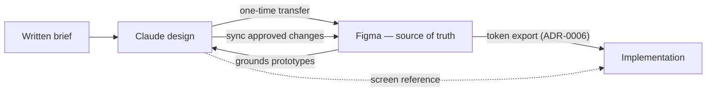

1. **Found the system in Claude design.** One generation from the brief, then focused
   iterations on motion and affordance.
2. **Improve it there** until the material rules held: one wooden frame, one glass,
   everything else flat.
3. **Transfer to Figma.** Variables, styles, documented foundations, and one page per
   component. From this point Figma is the source of truth.
4. **Sync Figma back into Claude design**, so the prototyping surface speaks the same
   names and values as the canonical file.
5. **Prototype app UX in Claude design** — screens, responsive behaviour, accessibility
   details — where iteration is conversational and cheap.
6. **Land the results in Figma** as screens and composite components, closing component
   gaps the screens exposed.

The loop stays live for implementation: prototype in Claude design, sync to Figma,
implement from Figma. Code consumes tokens by manual export
([ADR-0006](../adr/0006-tokens-generated-from-figma-by-manual-export.md)); screens in
both tools serve as reference, with Figma canonical for the design system.

## Screenshots

The first state Claude design produced from the brief, before any refinement:

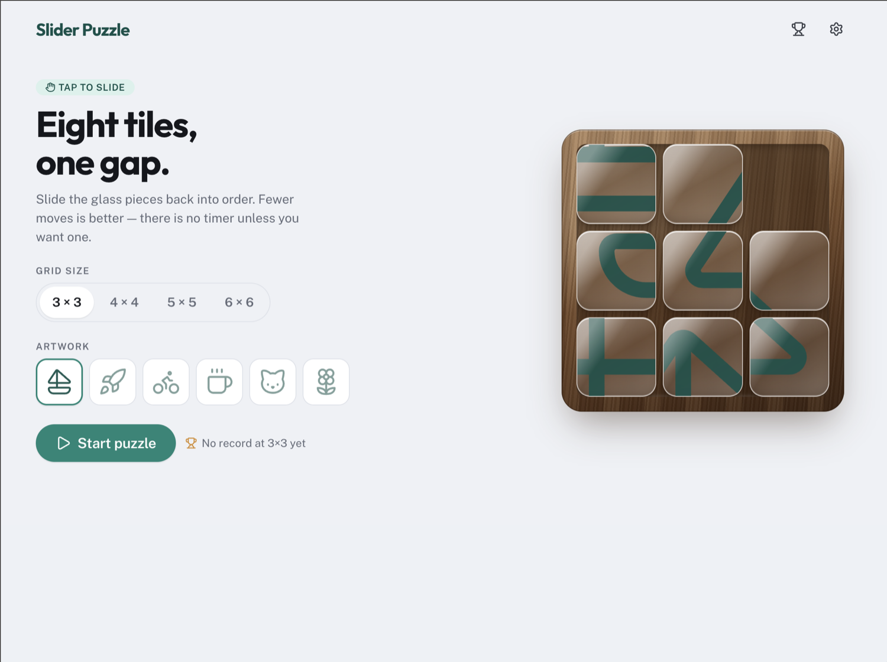

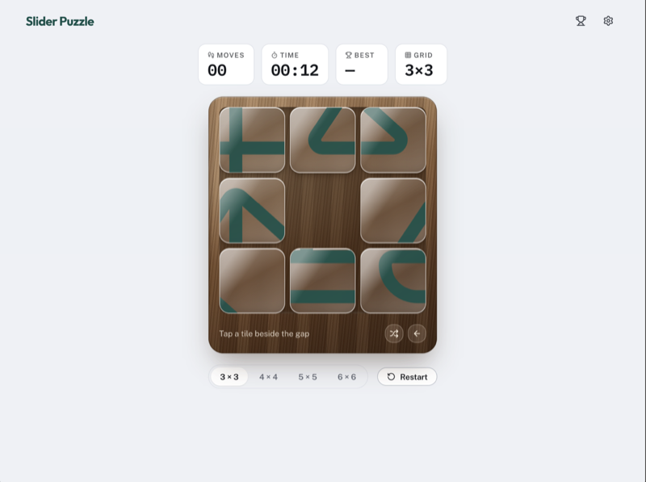

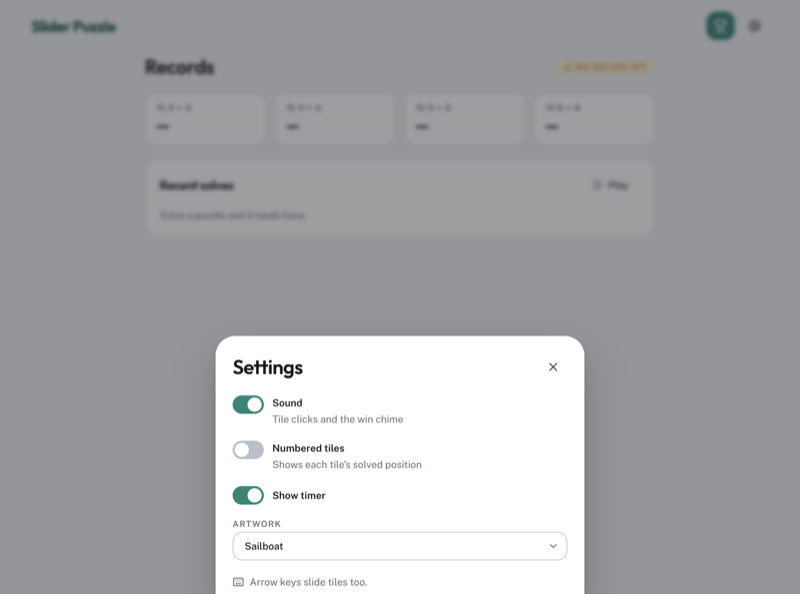

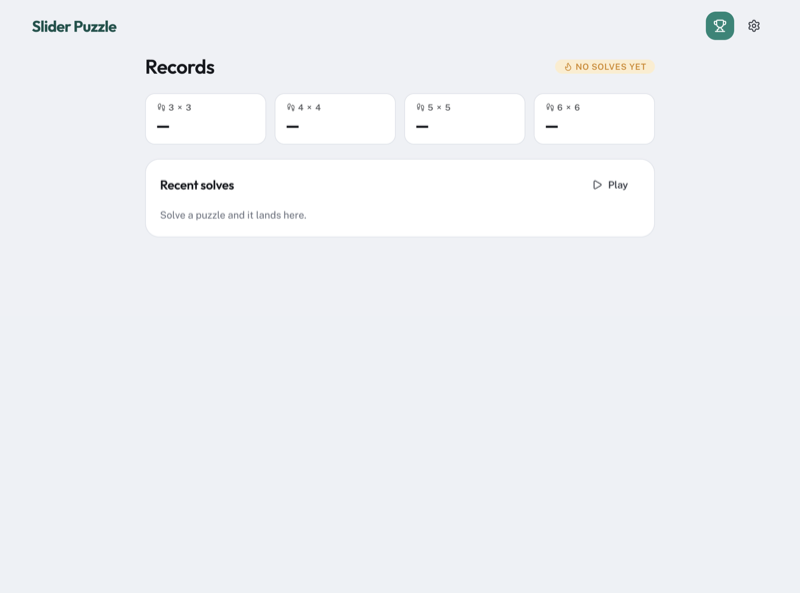

The first generation already had the two-material rule, the glass-on-wood board and the
full screen set. What changed later was placement and affordance, not the look — sound
moved out of the sheet into the header, artwork moved from a select into the setup
screen, and the grid-size control left the play screen once a game became
fixed-size for its lifetime.

The canonical system in Figma:

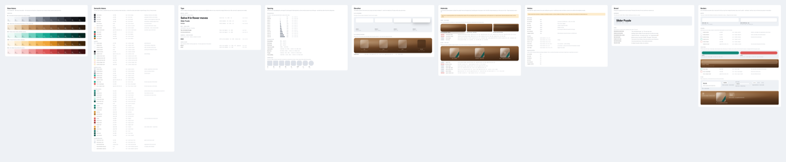

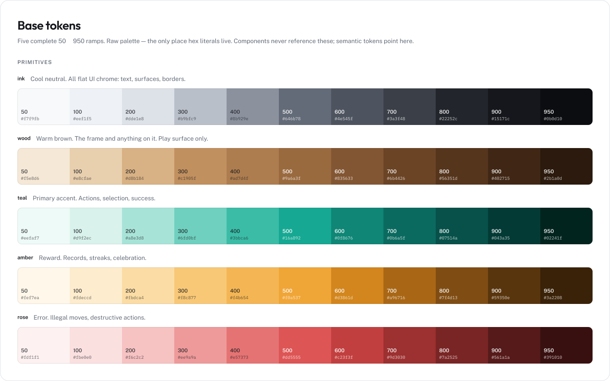

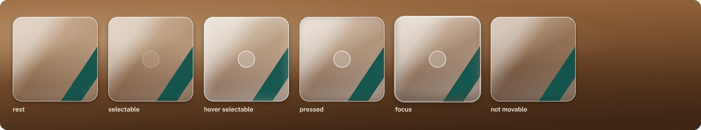

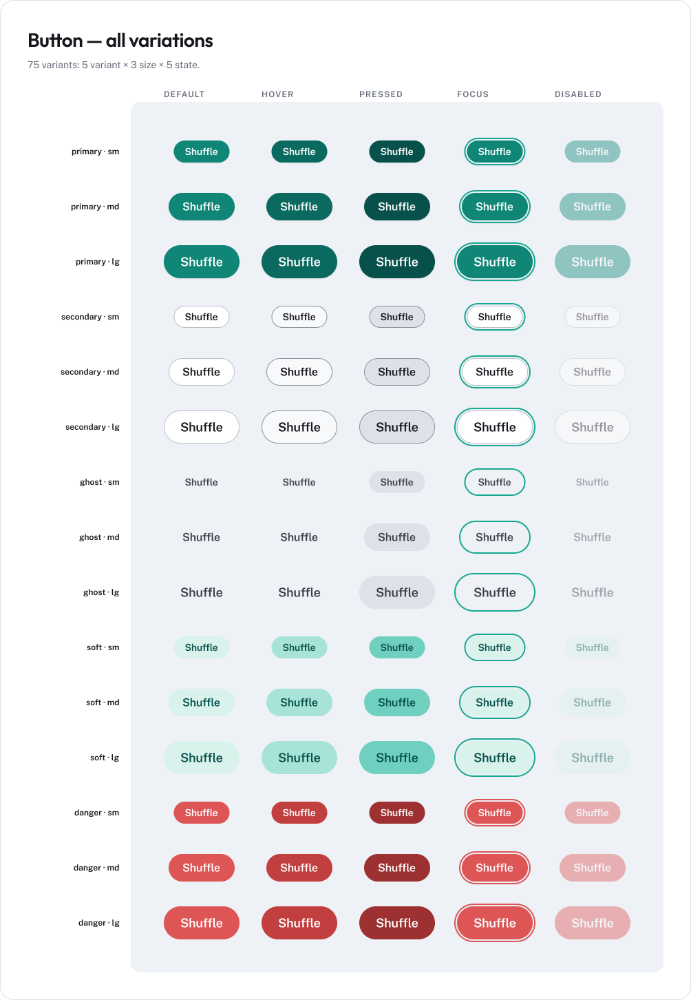

The finalized Setup screen, desktop and mobile — tiles scrambled into a solvable
position, not the completed picture:

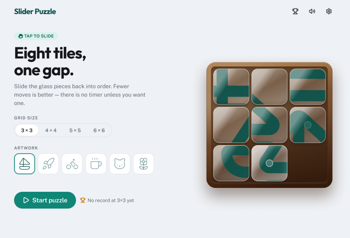

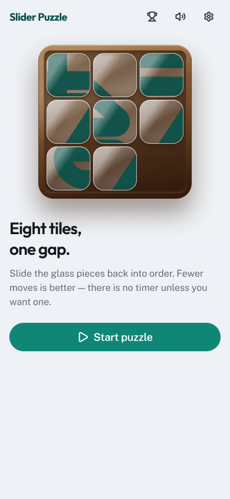

## Decisions

- **Founding iterations sharpened feel, not looks**: the shuffle hop went to 20ms with
  no overshoot, the tile hover became a flat hard-edged bead instead of a glow, and
  arrow keys name the tile relative to the gap.
- **Domain language beat generated names on transfer.** The generated `PuzzleTray`,
  `PuzzleTile`, `PuzzleBoard` became **Frame**, **Tile**, **Board** per
  [CONTEXT.md](../../CONTEXT.md) — "puzzle" is banned as a code term.
- **Tokens are two-tier in Figma**: a `Primitives` collection (scopes empty, invisible
  in pickers) aliased by semantic collections. Composites — shadows, type ramps — are
  Figma styles, because a variable cannot hold a multi-layer shadow or font shorthand.
- **What Figma cannot reproduce is documented, not faked**: repeating-gradient wood
  grain, `backdrop-filter` saturation, and zero-blur ring shadows (which Figma does not
  render — focus rings are stroke bands instead). The Materials card marks every
  declaration "in Figma" or "CSS only", with the CSS as source of truth.
- **The sync back was explicit, not drift.** Claude design was re-anchored with a Figma
  export and this prompt:

  > I have now created a Figma file based on the design system that was created here. I
  > want this Figma file to now be the source of truth. Analyze the file and assess what
  > needs to be updated here to get the design system in sync with Figma. Don't change
  > anything before I give approval.

- **The prototyping pass was UX and accessibility work**: mobile and desktop screen
  layouts, tooltips labeling icon-only navigation controls, a reference-image preview
  option, a fixed stat-tile grid, and a neutral colourless hover so no hue is added to
  the glass.
- **Screens exposed component gaps**, closed in Figma: Switch gained a description,
  Badge an icon, SegmentedControl a fourth option, Button an icon, and the app header became a composite
  component with desktop and mobile breakpoints.
- Design ran conversationally in Claude chat and Claude design; no tracker issues were
  filed for this phase.

## Next

Tokens, components, and screens are stable enough to implement against. The component
set phase builds them in code, consuming tokens by export and reading specs from Figma.

## References

- Figma file: [Slider puzzle](https://www.figma.com/design/r5wlPxDsJnLjZGJcrvmj9s/Slider-puzzle)
- [ADR-0006 — tokens generated from Figma](../adr/0006-tokens-generated-from-figma-by-manual-export.md)
- [CONTEXT.md](../../CONTEXT.md) — the domain vocabulary the design follows
