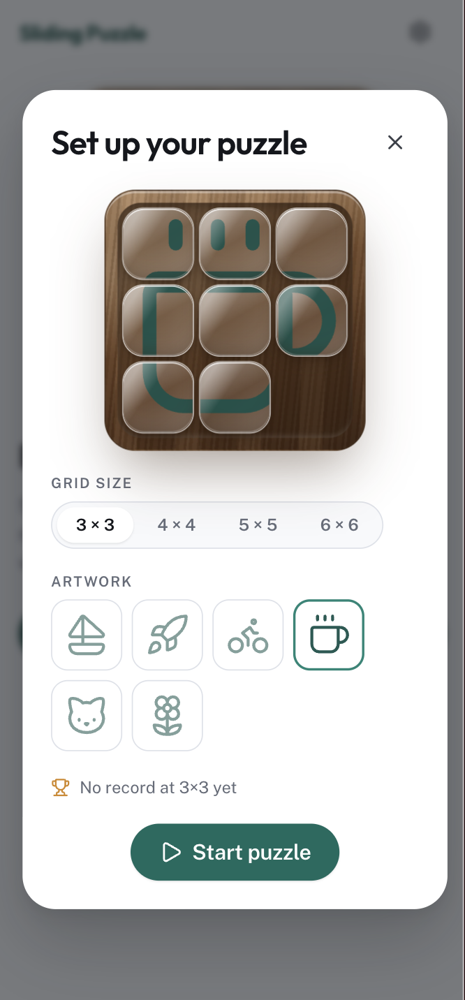
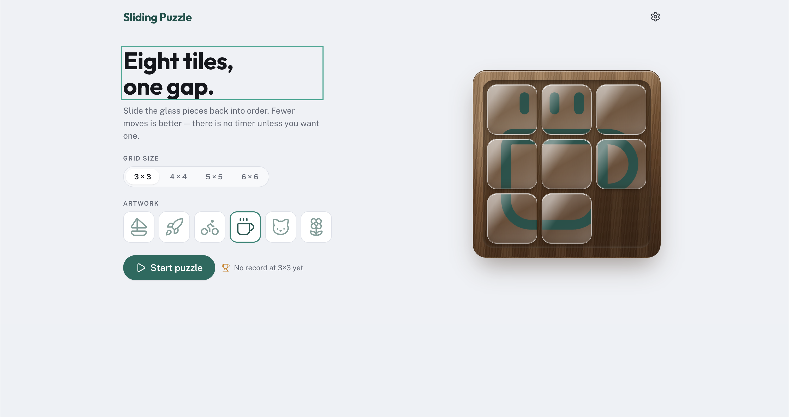
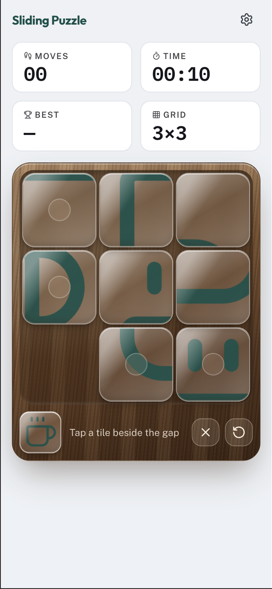
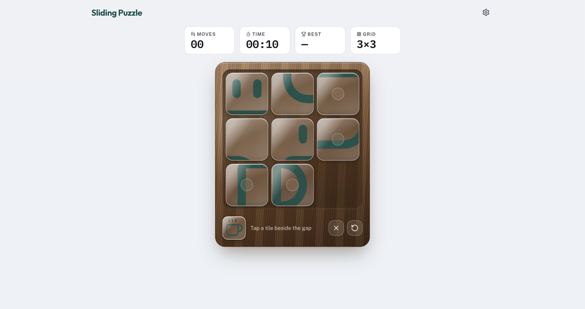
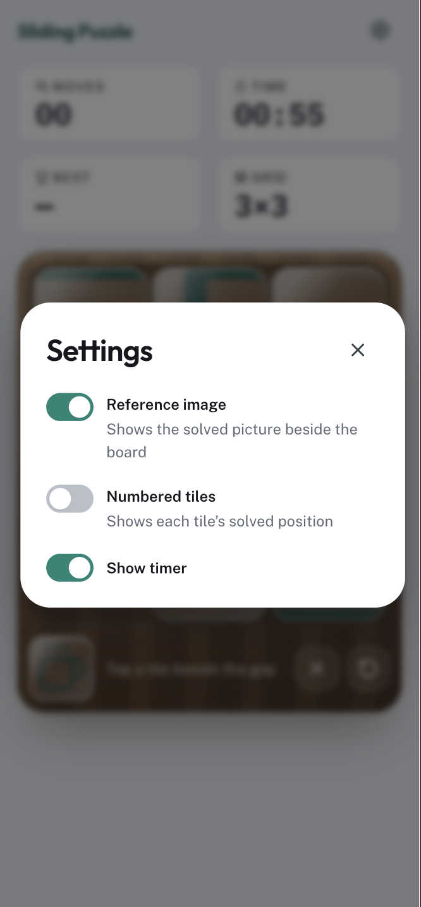
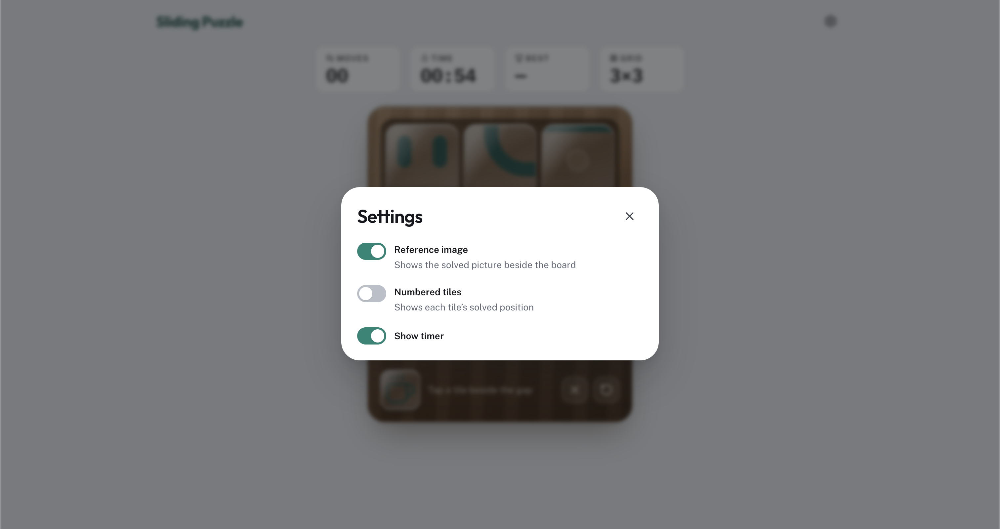

# 05: Game screens

## Goal

Build the app around the already-playable game. Routing, the app shell, and every screen
the design system was built for: Setup, Play, Solved, and Settings.

## Screenshots

Setup, mobile and desktop. Mobile gets a bottom sheet over the shuffled board it
configures; desktop gets a full page with the pitch alongside the same controls:

Play, mobile and desktop: Moves, Time, Best and Grid stat tiles above the board:

Settings, mobile and desktop: Reference image, Numbered tiles and Show timer, over a
blurred Play screen:

## How it went

1. **Five spec tickets ran first**: where game config, settings and records live; the app
   shell and navigation; Play and the Solved experience; Setup with its mobile sheet; and
   the Settings dialog. Nothing got built until each screen's shape was written down.
2. **The foundation landed before any screen did**: the widgets tier and its boundaries,
   Board and Tile promoted into it, the three state homes, the responsive breakpoint token
   and `useMediaQuery`, Dialog split into a generic Modal and the designed card, and
   react-router's data router adopted for the app shell.
3. **Screens composed in waves once the foundation held**: AppHeader, Play and Setup
   together; then the Solved dialog, abandon/restart confirmations and the SettingsDialog
   widget; then the mobile SetupDialog sheet, Play honouring Reference image and Numbered
   tiles, recorded solves surfaced as Best, and the navigation guard for a game in
   progress.
4. **The phase closed on accessibility and polish**: three VoiceOver/Safari passes (Play
   and Solved, Setup, Settings), plus fixes for arrow keys leaving no focus ring behind and
   closed dialogs swallowing pointer input.

## Decisions

The load-bearing ones live in [docs/adr/](../adr/):
[state homes are modular, and storage stays out of machines](../adr/0015-state-homes-are-modular.md),
[responsive breakpoints decided in JS, not CSS-only](../adr/0016-responsive-breakpoints-decided-in-js.md),
[routing on react-router's data router](../adr/0017-routing-on-react-router.md), and the
widgets-tier amendment to
[design-system components are born shared](../adr/0009-design-system-components-are-born-shared.md).

What the ADRs don't record:

- **Records stayed off the route table.** A dedicated Records screen was scoped out in
  favour of the Best stat, surfaced inline on Play and Solved instead. Two routes, Setup
  and Play, cover the whole app; per ADR-0017, the Records screen "was cut from this
  scope, not from the product."

## Next

The app is feature-complete for its first release: two screens, the full game lifecycle,
persisted config, settings and records, and three VoiceOver/Safari accessibility passes.
No further milestone is scoped yet.

## References

- Commits: `5d6caff`..`5e204d6`
